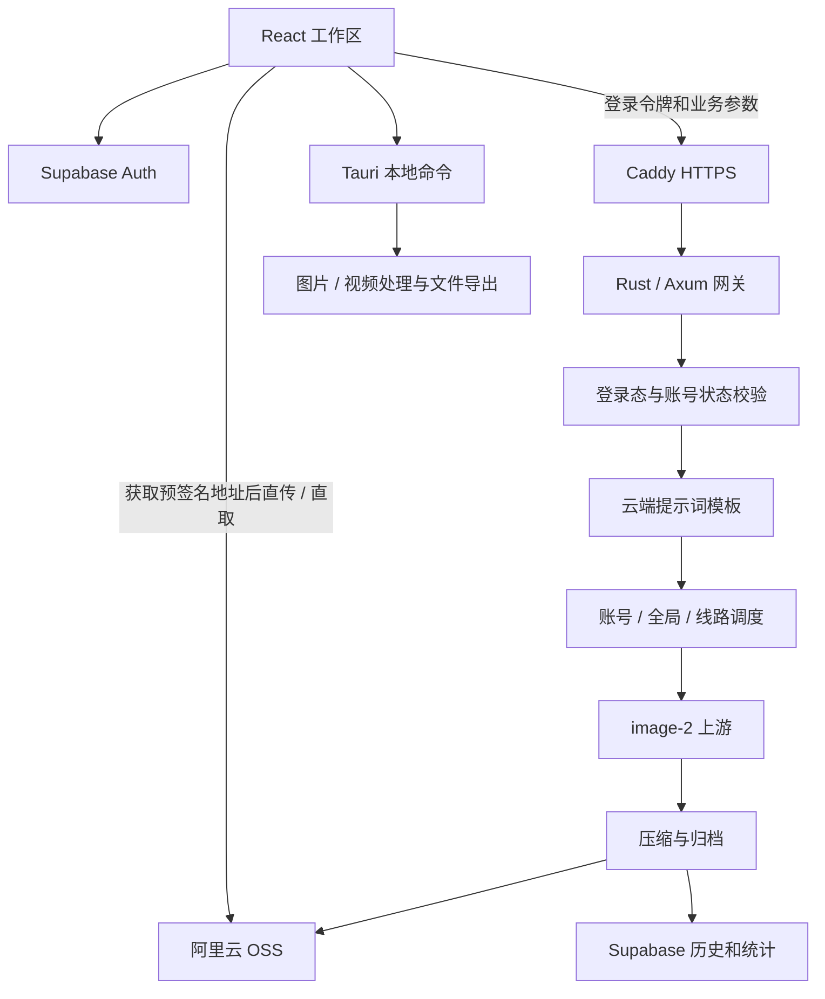

# 呈尚策划美工生图系统 PRO 项目分析报告

分析日期：2026-09-30。分析方法：使用 `project-analyzer` 技能，对当前工作区配置、入口、核心业务链路、数据库脚本、部署模板和测试进行静态分析，并执行前端构建及代表性测试。

分析对象是本机包含未提交改动的工作区，版本为 `3.0.51`，不代表已发布版本。未读取本地私密文件、环境变量真实值、SSH 密钥或 cookie 内容；未连接生产服务器、执行数据库操作、生图或发布安装包。

## 分析结论

这是面向外卖运营团队的 Windows 桌面业务系统，采用 React 界面、Tauri 本地能力、Rust/Axum 云端网关、Supabase 数据服务和阿里云 OSS 的组合架构。网关承担鉴权、提示词渲染、多线路调度、重试、归档和历史写入，客户端承担交互、图片展示及本地导出。

核心职责已具备分层：页面、工作区状态钩子(Hook)、前端业务库、网关调度和上游适配相对独立。OSS 素材直传、生成结果直取、账号停用校验和 APIMart 任务恢复体现了对实际运营场景的考虑。本次前端构建及 6 个代表性测试文件执行通过。

当前优先事项是核查数据库清理权限和员工安装包的密钥边界，随后治理网关入口、视频处理和工作区总调度的大文件。更新策略与文档、systemd 状态目录权限也存在差异，需在后续发布前核对。本次只记录问题和建议，没有实施业务代码重构。

## 1. 项目结构

根目录：`J:\christescuobermeyer-max\image-2生图系统`。

| 目录 | 主要职责 | 本次统计 |
|---|---|---|
| `src/` | React 页面、状态、业务接口和类型 | 153 个 JS/TS 源文件 |
| `src/components/` | 工作区、管理后台、结果展示和通用组件 | 52 个直接文件/子目录 |
| `src/components/workspace/` | 多店铺工作区页面包装 | 12 个直接条目 |
| `src/hooks/` | 登录、主题及各工具状态编排 | 15 个直接条目 |
| `src/lib/` | 生图、OSS、Supabase、历史和导出辅助逻辑 | 60 个直接条目 |
| `src-tauri/src/` | 桌面本地命令与云端共享 Rust 模块 | 40 个 Rust 文件，含 `bin/` |
| `supabase/` | 主 schema 与增量数据库迁移 | 19 个迁移文件 |
| `prompt-templates/` | 云端可维护提示词源文件 | `generation-prompts.json` |
| `tests/` | 行为断言和源码契约测试 | 107 个测试文件 |
| `scripts/` | 构建、诊断、导出、发布和 Windows 网关运维 | 39 个直接条目 |
| `docs/` | 架构、运维、参考和实施记录 | 已有分类索引 |
| `public/` | 品牌标识、登录海报等静态资源 | 由 Vite 复制到构建产物 |

组织方式是“技术分层 + 业务工具模块”，没有采用多个独立 npm 包的工作区结构；桌面端和网关在同一个 Rust crate 中共享模块，并通过 Cargo 功能开关(Feature)区分构建。

`src/` 的直接条目数为 8，但 `components/`、`hooks/`、`lib/`、Rust 源码目录和测试目录超过项目建议的功能目录规模。后续可按生图、历史、账号、媒体处理等业务边界分层，避免一次性搬迁全部文件。

## 2. 技术栈

以下精确版本来自锁文件，不是对最新版本的判断。

| 层级 | 技术与版本 | 用途 |
|---|---|---|
| 前端 | React / React DOM `18.3.1` | 组件和交互状态 |
| 语言与构建 | TypeScript `5.9.3`、Vite `6.4.2` | 严格类型检查及前端打包 |
| Supabase 客户端 | `@supabase/supabase-js 2.105.1` | 登录、历史、统计、更新配置 |
| 桌面接口 | Tauri JS API / CLI `2.10.1`，Rust Tauri `2.10.3` | 本地命令、窗口、插件和安装包 |
| 网关 | Axum `0.7.9`、Tokio `1.52.1` | HTTP 路由和异步执行 |
| HTTP 客户端 | 直接依赖 reqwest `0.12.28` | 上游 API、OSS 和 Supabase 请求 |
| 图片处理 | image `0.25.10` | 解码、缩放和 JPEG 压缩 |
| 序列化 | serde `1.0.228`、serde_json `1.0.149` | 请求、响应和状态文件 |
| OSS | aliyun-oss-rust-sdk `0.2.2` | 对象上传和签名 |
| 数据库 | Supabase Auth + PostgreSQL + 行级安全(Row Level Security, RLS) + pg_cron | 身份、持久化、权限及定时清理 |
| 视频处理 | ffmpeg、yt-dlp 外置程序 | 视频解析、下载、裁剪和导出 |
| 部署 | Ubuntu、systemd、Caddy | 网关进程和 HTTPS 反向代理 |
| 测试 | Node 断言、tsx、Rust 内置测试 | 业务函数及源码契约 |

本机执行使用 Node `22.17.0`。Rust 使用 2021 edition；本次没有编译 Rust 或验证服务器实际运行版本。`Cargo.lock` 同时包含 reqwest `0.13.3`，不能据此把项目声明的直接依赖版本改写为 `0.13.3`。

## 3. 架构模式

主要模式是分层架构(Layered Architecture)与组件架构(Component-Based Architecture)，部署上是桌面客户端加单个云端业务网关。Supabase 和 OSS 是外部托管服务，当前代码不属于业务微服务(Microservices)集群。

架构中的关键选择：

- 配置网关 URL 时，前端通过 HTTP 调用云端，生图密钥原则上应留在服务器；未配置时，多数生图工具通过 Tauri 调用本地 Rust。菜单设计明确要求连接网关。
- 桌面库和 `backend-gateway` 通过同一批源文件复用上游、OSS、图片处理及调度逻辑；网关以 `--no-default-features` 构建，排除 Tauri 专属能力。
- 提示词使用 `prompt_config.key + variables`，网关从 JSON 文件渲染。模板在渲染时读取，可以更新模板而不重打客户端包；新业务参数和界面通常仍需客户端更新。
- 队列、健康采样和并发计数位于网关进程内存；暂停状态和 APIMart 待恢复任务有文件持久化路径，但依赖目录可写。
- 结果支持 OSS URL 与内联 Base64 两种协议，保留旧客户端兼容。归档失败时可退回 Base64，生成图仍可下载，历史统计不一定成功。

队列不是跨实例共享的持久化任务系统。直接启动多个网关进程会各自维护并发和队列，不能将当前配置的全局上限视为跨进程总上限。

## 4. 核心模块

| 模块 | 关键文件 | 职责和边界 |
|---|---|---|
| 前端入口 | `src/main.tsx`、`src/App.tsx` | 主题、错误记录、登录态、更新入口及应用壳 |
| 工作区目录 | `src/lib/workspace-catalog.ts` | 17 个工作区定义；普通用户导航 15 项，管理员 16 项，P 门头隐藏于导航 |
| 工作区总调度 | `src/hooks/useGenerationWorkspace.ts` | 多店铺槽位、忙碌统计、历史记录和计数 |
| 页面分发 | `src/components/WorkspacePages.tsx` | 按工作区类型选择页面，使用 `assertNever` 检查未覆盖类型 |
| 通用生图流程 | `src/lib/workspace-session.ts`、`workspace-generation.ts` | 输入快照、状态变更、生图及归档结果处理 |
| 传输入口 | `src/lib/tauri.ts` | 网关 / 本地调用分支、OSS 预签名上传、结果下载、更新和文本接口 |
| 登录与权限 | `src/hooks/useAuth.ts`、`src/lib/auth.ts`、网关鉴权函数 | 会话恢复、账号停用校验、管理员二次校验 |
| 云端入口 | `src-tauri/src/bin/backend_gateway.rs` | HTTP 路由、鉴权、生成、归档、恢复、统计和管理接口 |
| 调度 | `gateway_queue.rs`、`gateway_limiter.rs`、`line_health.rs` | 等待队列、用户限制、线路容量、尺寸兼容和健康采样 |
| 上游适配 | `api.rs`、`image_provider.rs`、各 `*_edit.rs` 与 `apimart*.rs` | 各供应商请求、响应、轮询和错误处理 |
| 云端提示词 | `prompt_templates.rs`、`prompt-templates/generation-prompts.json` | 模板查找、变量上下文和占位符渲染 |
| 归档与历史 | `src/lib/oss-assets.ts`、`cloud-history.ts`、Rust `oss.rs` | 素材上传、结果归档、分页历史和统计读取 |
| 菜单设计 | `useMenuDesignWorkspace.ts`、Rust `menu_design.rs` | 文字 / 截图整理、人工核对及菜单生图 |
| 本地媒体处理 | `image_proc.rs`、`video_commands.rs` | 图片尺寸调整、文件保存、视频解析与导出 |
| 更新 | `MandatoryUpdateGate.tsx`、`app-update.ts`、Rust `app_update.rs` | 更新检查、进度事件、安装程序启动和应用退出 |

状态管理主要使用 React `useState`、`useRef`、`useEffect` 和业务钩子，没有发现 Redux、Zustand 或路由库依赖。Toast 使用上下文，认证会话由 Supabase 管理，主题及部分本地历史使用本地存储。

## 5. 数据流

### 5.1 登录与权限

前端使用 Supabase 登录并恢复会话。`profiles` 保存显示名、角色、启用状态及软删除字段。前端每 60 秒重新获取用户档案，网关业务请求另外通过 Supabase Auth 校验令牌并检查 `profiles.is_active`。管理员接口再检查角色，不能只依赖界面隐藏后台导航。

### 5.2 生图与交付

1. 工作区保存店铺、平台、参考图和外观参数，准备业务输入快照。
2. 素材通过网关获取预签名地址，客户端直接 PUT 到 OSS；前端素材上传默认并发为 2，并有有限重试。
3. 生图提交 `prompt_config`、尺寸、参考图 URL 和归档元数据。客户端不自动重发完整生图请求，当前 `AUTO_GENERATION_MAX_ATTEMPTS = 1`。
4. 网关鉴权后渲染提示词，申请调度许可，按尺寸、剩余容量、健康和排除列表选择线路。
5. 网关最多循环尝试 6 次。线路 2/3/4 共用 Zikl 上游，任一失败时本次请求排除三条；上游结果不明确时停止自动重试，以减少重复生成风险。
6. 上游成功后先释放生图许可，再以独立归档并发控制压缩并上传 OSS，写入 Supabase 历史。
7. 新客户端协商 `result_delivery=oss_url`，网关返回签名地址，客户端直接下载并转换成展示数据。旧协议或归档失败可返回 Base64。
8. 前端根据 `history_recorded/history_error` 避免正常情况下重复写历史；归档或历史写入失败有独立处理。

默认值来自源码，生产可由环境变量覆盖：前端同时忙碌的工具槽位上限 10，网关每账号生图并发 5，全局生图并发 30，OSS 归档并发 6。前端统计单位是工具槽位，网关许可单位是具体请求，二者不是同一计数口径。

自动调度范围是线路 2 至 7。默认线路容量依次为 6、6、6、8、8、6，选择时先排除不支持尺寸、暂停或 Red 线路，再以当前活跃数、健康等级、延迟及固定顺序排序。

APIMart 线路在提交任务后记录待恢复信息，后台恢复成功图并补写历史。该恢复路径要求持久化状态可用，并在没有用户令牌时依赖服务器 service role；本次未验证生产恢复过程。

### 5.3 数据模型与保存周期

| 模型 / 表 | 主要数据 | 作用 |
|---|---|---|
| `UploadedImage` | 本地展示数据、参考图 Base64、OSS URL | 上传素材 |
| `GenerationItem` | 状态、结果、线路、耗时、归档和历史状态 | 工作区单张结果 |
| `RemotePromptConfig` | 模板 key 和变量对象 | 云端提示词协议 |
| `profiles` | 用户角色、启用状态、登录信息 | 账号与权限 |
| `generation_logs` | 用户、店铺、产品名、类型、平台、OSS 地址、线路、耗时 | 成功归档历史 |
| `generation_totals` | 每用户永久累计 | 不随历史清理减少 |
| `generation_monthly_totals` | 上海自然月累计 | 月度统计 |
| `login_logs` | 登录审计记录 | 登录统计 |
| `daily_generation_stats` | 上海自然日聚合视图 | 每日统计 |
| `app_update_config` | 最新版本、安装包地址、更新内容、强制开关 | 更新配置 |

历史记录保存 7 天，插入触发器递增永久及月度计数。删除历史与删除 OSS 对象不是同一操作，不能仅凭数据库清理函数认定对象已从存储删除。

### 5.4 更新与文档差异

当前 `MandatoryUpdateGate.tsx:46` 调用的是 `fetchAvailableUpdate()`，条件为存在更高版本和安装包地址，允许“稍后更新”；此入口不以 `force_update=true` 作为弹窗条件。工作区进入生图忙碌状态后，本次运行把更新延后到重启。

`docs/自动更新.md` 和 `docs/项目总览.md` 仍描述基于 `force_update` 的强制更新。当前代码中强制判断辅助函数仍存在，但不能据此认为实际弹窗执行强制策略。发布脚本的灰度 / 开启 / 暂停语义需与当前客户端策略同步。

## 6. 配置与部署

| 配置文件 | 作用 | 当前观察 |
|---|---|---|
| `package.json` | npm 依赖和命令 | 版本 `3.0.51`，没有统一 `test` 脚本 |
| `tsconfig.json` | 前端 TypeScript | 开启 strict、未使用变量和参数检查 |
| `vite.config.ts` | Vite、版本注入、开发端口 | 端口 1420，严格端口；从 package 版本注入 `__APP_VERSION__` |
| `src-tauri/Cargo.toml` | 桌面与网关 Rust 构建 | 默认启用 `tauri-commands` |
| `src-tauri/tauri.conf.json` | 窗口、资源、安装包 | 版本一致；MSI / NSIS，ffmpeg / yt-dlp 和 cookie 资源声明 |
| `src-tauri/capabilities/default.json` | Tauri 能力授权 | 对话框、文件写入和 shell 打开 |
| `src-tauri/build.rs` | 构建配置注入 | 从本地环境文件解析键值并注入 Rust 编译环境 |
| `scripts/build-employee-installer.ps1` | 员工包构建入口 | 设置网关 URL 后调用 NSIS 构建 |
| `docs/cloud-gateway/update.sh` | 云端升级 | 拉代码、编译、替换、同步提示词、重启和健康检查 |
| `docs/cloud-gateway/csgh-backend-gateway.service` | 进程管理模板 | 限制资源、只读文件系统和自动重启 |
| `docs/cloud-gateway/Caddyfile` | HTTPS 反向代理模板 | 上游 8787、420 秒超时和 50 MB 请求体限制 |

项目文档描述生产为香港 Ubuntu 服务器上的 systemd + Caddy，公网入口 `https://gw.hbcsch.pw`。这是文档记录，本次没有验证 DNS、实际服务、上游余额或数据库迁移状态。

配置边界应分为前端公开配置、服务器秘密和本地直连秘密。实际源码存在编译期密钥注入能力，不能只设置网关 URL 就推定安装包未包含秘密，详见风险清单。

仓库未发现 `.github/`，`package.json` 未声明 lint、统一测试或锁定的 tsx 开发依赖。本次 `npx --no-install tsx` 可以运行，说明当前机器已有可用执行环境；新机器的测试可复现性仍需补齐。

## 7. 关键依赖与共享边界

- React 与 React DOM 定义界面和状态生命周期；当前工作区常驻实例较多，组件生命周期是重构时的重要约束。
- Tauri API、dialog、fs、shell 提供原生能力；业务 HTTP 调用同时使用浏览器 fetch，项目不是只通过本地进程访问服务器。
- Supabase JS SDK 使客户端直接承担 Auth、历史查询和部分数据库写入，数据库权限配置属于关键业务边界。
- Tokio、Axum、reqwest 定义网关的异步请求和等待机制；Rust 模块被桌面库及网关二进制分别纳入编译。
- image 和 OSS SDK 决定正式交付图的压缩及存储，归档规格需要覆盖平台导出尺寸。
- ffmpeg / yt-dlp 不属于 npm 运行时依赖，安装包与新机器验证必须包含外置程序及资源路径。
- `postgres` 是开发依赖，用于受控运维脚本，不代表前端直接连接 PostgreSQL。

前端运行时被引用较多的业务文件包括 `src/lib/tauri.ts`（26 个导入方）、`utils.ts`（19 个）、`supabase.ts`（11 个）、`generation-retry.ts`（11 个）及 `prompt-config.ts`（10 个）。修改这些共享入口时，验证范围应覆盖多个工作区。

本次没有进行依赖漏洞扫描或联网核查维护状态，不能据版本号判断依赖安全性或是否过时。

## 8. 代码健康度

### 8.1 文件规模

扫描 `src/`、`src-tauri/src/`、`tests/` 和 `scripts/` 中 JS、TS、Rust、Python 文件，排除依赖、构建目录、私密文件、数据和脚本输出目录。行数为静态估算：剔除空行、导入语句和块注释，保留普通单行说明；Rust 同文件测试计入总规模，并额外列出生产段规模。未统计 PowerShell、SQL、CSS 或根目录工具文件。

| 范围 | 文件数 | 估算有效行 | 超过限制 | 超标超过 30% | 达到 80% 但未超标 |
|---|---:|---:|---:|---:|---:|
| 前端源文件 | 153 | 17,209 | 21 | 10 | 18 |
| Rust 源文件 | 40 | 12,106 | 13 | 8 | 6 |
| 测试文件 | 107 | 6,567 | 2 | 0 | 4 |
| JS / Python 运维脚本 | 35 | 3,871 | 5 | 4 | 2 |
| 合计 | 335 | 39,753 | 41 | 22 | 30 |

按此口径约 87.8% 文件符合规模上限，业务源文件 193 个中有 34 个超标。行数不能直接转换成项目质量评分；本报告不提供未经验证的覆盖率或整体分数。

| 重点文件 | 估算有效行 | 剔除末尾测试模块后的规模 | 项目上限 |
|---|---:|---:|---:|
| `src-tauri/src/bin/backend_gateway.rs` | 2,699 | 2,343 | 250 |
| `src-tauri/src/video_commands.rs` | 1,249 | 1,188 | 250 |
| `src/hooks/useGenerationWorkspace.ts` | 667 | 667 | 200 |
| `src-tauri/src/prompt_templates.rs` | 587 | 506 | 250 |
| `src-tauri/src/gateway_queue.rs` | 583 | 400 | 250 |
| `src-tauri/src/image_proc.rs` | 561 | 489 | 250 |
| `src-tauri/src/gateway_limiter.rs` | 553 | 344 | 250 |
| `src/hooks/useImageEditWorkspace.ts` | 465 | 465 | 200 |
| `scripts/export-oss-images-incremental.mjs` | 454 | 454 | 200 |
| `src/lib/tauri.ts` | 382 | 382 | 200 |

`global.css` 约 5,497 个物理行；CSS 不适用当前语言行数上限，但页面样式集中可能增加定位和样式冲突成本。

### 8.2 依赖与重复

使用 TypeScript 语法树(AST)解析相对导入、再对依赖图分析，前端未发现运行时导入环，但存在两组包含类型引用的依赖环：

- `tauri -> prompt-config -> image-edit -> picture-wall -> oss-assets -> tauri`。其中 `tauri -> prompt-config` 和 `prompt-config -> image-edit` 是类型导入，编译后擦除。
- `VideoEditor -> CropBox / TimelineSlider -> VideoEditor`。子组件引用父组件中的 `CropArea`、`TimeRange` 类型。

Rust 的 `crate::模块` 静态引用扫描发现 `api -> api_validation -> api` 和 `api -> image_generation_payload -> api`。反向引用用于读取 `GenerateRequest` 类型。Rust 允许这种模块互相引用，不等同于循环调用或独立 crate 循环依赖，但会让协议类型依赖业务入口。

建议把 Rust 请求类型和视频编辑公共类型分别放到中立类型模块。当前不应把这些结果描述成已发生运行时循环故障。

`useGenerationWorkspace` 显式创建 10 组各 10 个工作区钩子，另有 1 个菜单钩子，共 101 个工具状态实例。槽位声明与共同参数有明显重复，每个状态变化会经共享父级重新渲染。当前没有性能测量，因此这属于结构风险，不能断言已经造成卡顿。不能直接把钩子改为循环或按标签条件调用，重构需遵守 React 钩子规则，并保留切换标签后的未下载结果。

### 8.3 复杂度抽查

按语法树统计条件、循环、case、catch、三元和逻辑运算符的分支，以下是复杂度近似值，未使用专用覆盖率或圈复杂度工具：

| 函数 | 位置 | 近似复杂度 |
|---|---|---:|
| `BalanceCard` | `src/components/admin/AdminBalancePanel.tsx:106` | 27 |
| `GenerationResultTile` | `src/components/GenerationResultTile.tsx:28` | 26 |
| `isHistoryEntry` | `src/lib/history.ts:114` | 24 |
| `WorkspacePages` | `src/components/WorkspacePages.tsx:33` | 19 |
| `AdminGatewayMonitor` | `src/components/admin/AdminGatewayMonitor.tsx:16` | 16 |

JSX 条件展示和对象校验会提高该值，应结合职责判断，而不是单靠数值拆分。`buildGenerationPayload` 有较长参数列表，适合在相关功能修改时使用已有配置对象表达共同参数，避免扩大当前分析任务的改动范围。

## 9. 风险与改进建议

| 优先级 | 问题及证据 | 影响 | 建议 |
|---|---|---|---|
| 高 | `supabase/schema.sql:238` 清理函数使用 `security definer`，按调用方 `p_cutoff` 全表删除，`:258` 授权 `authenticated` 执行 | 若生产沿用此定义，普通登录用户可传入未来截止时间，删除其他用户的近期历史；RLS 不构成此函数的充分保护 | 优先撤销普通用户执行权限，由 pg_cron / 服务器固定清理；若必须保留客户端入口，在数据库强制截止时间不晚于服务器的 7 天前，并限定作用范围 |
| 高 | `src-tauri/build.rs:18` 注入本地配置；`env_config.rs:25` 起包含 OSS 密钥和 service role 的 `option_env!`；员工打包脚本只设置网关 URL | 从含秘密的开发环境构建员工包时，相关密钥可能嵌入二进制，即使界面已走网关；本次未检查实际安装包 | 建立员工构建模式和公开配置白名单，禁止服务秘密进入员工包；用假密钥做构建验证并只输出检查结果 |
| 高 | `git status` 显示本地环境备份和 SSH 密钥文件未跟踪，`git check-ignore` 未命中 | 后续整体暂存可能误提交私密文件；当前没有证据表明这些文件已提交 | 为 `.env.local.bak*` 和本机密钥文件添加忽略规则，保留在本机；核查已有发布和 Git 历史时避免输出秘密内容 |
| 高（维护） | 网关约 2,699 有效行、视频约 1,249 行、总工作区约 667 行 | 同文件承担多种职责，变更审查和回归范围较大，明显超出项目限制 | 优先按下述分阶段建议拆分，每一步保持协议和行为不变 |
| 中 | `MandatoryUpdateGate.tsx:46` 使用可选更新入口，与强制更新文档不一致 | 灰度配置和 `force_update` 的运维预期可能不符 | 先明确当前已采用的更新策略，再同步文档、命名、发布脚本语义及测试 |
| 中 | systemd 模板 `ProtectSystem=strict`，`ReadWritePaths` 仅允许日志和 `/tmp`；网关默认状态目录位于 `/opt/csgh-gateway/state` | 按模板部署时暂停状态、APIMart 任务持久化可能不可用；实际生产是否覆盖需核查 | 为状态目录配置属主和可写例外，或改到允许写入的持久化目录，并验证重启恢复 |
| 中 | 自定义安装流程接受 HTTP，未发现客户端校验预期 SHA-256 或安装包签名 | 安装前的真实性、完整性依赖配置和传输；发布脚本输出 SHA-256 不等于客户端校验 | 更新下载要求 HTTPS，配置预期校验值并在启动安装前验证；结合正式安装包签名流程 |
| 中 | 107 个测试中 95 个读取源码，部分依赖字符串断言；没有统一测试命令 | 结构变更可能让源码断言失败，字符串存在也不能证明真实鉴权和并发行为 | 保留必要协议断言，同时为鉴权、数据库权限、队列公平性、恢复和归档失败增加行为验证；锁定测试执行器 |
| 建议 | `tauri.conf.json` 的内容安全策略(Content Security Policy, CSP)为 null，本地资源协议允许多个盘符通配；网关跨域策略(CORS)允许任意来源 | 桌面内容及跨域请求缺少进一步范围约束；仅此配置不足以证明存在攻击路径 | 按实际本地资源与请求域名需求收紧，保留图片、视频预览和插件兼容验证 |

风险均基于当前代码或仓库模板。数据库函数、安装包和 systemd 的实际生产状态是待验证项，不作为已发生的数据删除、密钥泄露或恢复失败结论。

### 建议执行顺序

1. **先核查安全边界。** 清理权限预计涉及 schema、迁移、前端清理入口和测试；员工包涉及 build.rs、环境读取和构建入口。用假数据及假密钥验证，不操作生产历史。粗略估计各半天至一天，取决于现有构建与数据库部署方式。
2. **拆分网关入口。** 将鉴权、生成与归档、统计 / 管理路由、视频解析和任务恢复按职责提取；入口保留模块组合和路由注册。先完成一条纵向业务边界，运行 HTTP 行为测试，再继续下一条。整体估计 2-4 天，不建议一次提交全部拆分。
3. **拆分本地媒体处理。** 视频按解析、下载、导出参数和历史文件管理拆分；图片按压缩、尺寸调整和批量处理拆分。保持 Tauri 命令名称和输入输出一致。估计 1-2 天，需要外置程序和本地文件验证。
4. **治理工作区总调度。** 先提取历史 / 计数和容量统计，再设计多店铺状态归属；保持钩子调用顺序和跨标签状态。估计 1-2 天，重点验证输入、忙碌、刷新、切换和未下载图片。
5. **补齐发布和验证入口。** 同步可选更新策略与文档，修正状态目录模板，加入统一测试命令及构建门禁。后续在相关功能变更中整理业务目录与中立类型模块。

以上时间是工程量估计，不是已经执行的计划。本次用户请求是项目分析，未调整权限、构建、更新策略或生产环境。

## 10. 本次验证

| 命令 | 结果 | 证据范围 |
|---|---|---|
| `npm run build` | 通过，退出码 0 | 当前前端类型检查和 Vite 构建 |
| `npx --no-install tsx tests/generation-retry.test.ts` | 通过，退出码 0 | 前端不自动重复提交生图的行为 |
| `npx --no-install tsx tests/oss-result-delivery.test.ts` | 通过，退出码 0 | URL 交付协议及模拟 OSS 下载 |
| `npx --no-install tsx tests/workspace-catalog.test.ts` | 通过，退出码 0 | 工作区目录、导航和权限可见性 |
| `npx --no-install tsx tests/mandatory-update.test.ts` | 通过，退出码 0 | 当前更新判断和组件契约 |
| `npx --no-install tsx tests/gateway-auto-line-routing.test.ts` | 通过，退出码 0 | 网关自动线路选择源码契约 |
| `npx --no-install tsx tests/menu-design.test.ts` | 通过，退出码 0 | 菜单输入与客户端 / 网关集成契约 |

构建产物主 JS 约 685.18 kB，gzip 195.32 kB；CSS 约 130.68 kB，gzip 22.44 kB。Vite 提示主块超过 500 kB，并提示 Tauri API / dialog 同时被静态和动态导入，动态导入未实现该模块拆块。它们是构建警告，不是构建失败。

更新测试运行时打印未配置 Supabase 的提示，但测试退出码为 0；这属于测试环境提示，不代表生产配置缺失。未运行完整 107 个测试、Rust 测试、Tauri 打包、数据库权限集成验证、桌面交互或压力测试。本次结果不能证明生产网关或所有工作区均无回归。

## 11. 后续阅读

- [项目总览](../项目总览.md)：业务、云资源和运行链路。
- [文档索引](../文档索引.md)：专项文档入口。
- [生图并发与网关分配框架](生图并发与网关分配框架.md)：调度设计。
- [生图结果 OSS 直连分发方案](生图结果OSS直连分发方案.md)：协议兼容与交付。
- [自动更新](../自动更新.md)：发布操作；使用时先核对本报告列出的策略差异。
- [菜单设计计划](../plans/2026-09-18-menu-design.md)：菜单工作区及部署依赖。
